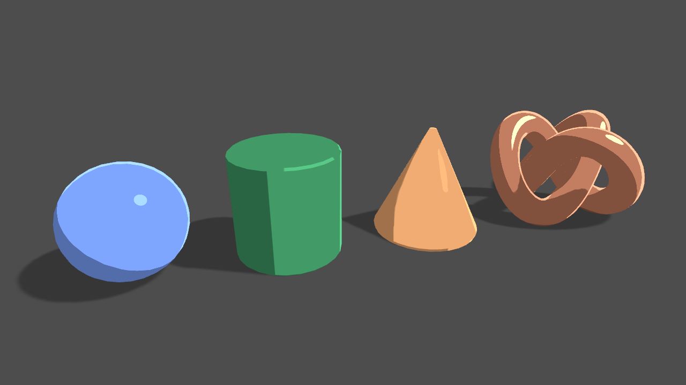

# OctaOut
## By Ria Khan
Alternative input stealth game about an octopus escaping a sushi restaurant.

## The Idea and Core Mechanics
The player is a cute octopus that is trying to escape a sushi restaurant and avoid becoming lunch! The goal of the level is to sneak out of the restaurant by hiding behind objects, crawling into containers, and essentially qwoping your way out. The added fun is that you really are the octopus--by controlling its tentacles with the movement of your fingers! The way this works is that the alt. controller is a set of gloves that uses flex sensors to sense how the player curls their fingers and thus curling and moving the tentacles of the octopus. So yes, octopus qwop, @ me Bennett Foddy.

## Design goals
Alternative Controller
Stealth
Funny physics that isn't too difficult

# Process Update no.1

## Super tentative timeline

wk1: Create a prototype model of octopus, connect physical computing data to unity (I've done arduino->unity serial communication before, and am confident in my 3D modeling skills, so I find this to be a good first step!) I'll also be doing some level design sketching, and I want to start off as simple as possible and build more complexity to the level based on do-ability through assessing my progress in these next few weeks. 

wk2: Use flex sensors to test out moving octopus legs (understanding how the incoming data from arduino moves the rigged limbs; using incoming data is good, rigging the limbs is ahhh). Further level design developing as well.

wk3: MAKE OR BREAK WEEK. If I can't get the sensors to work, I will figure out a different way of controlling the octopus whether it's a different method of alternative input or using traditional controllers.

wk4: Prototype of level and playing around with the physics and movement of the octopus with the determined controller. If very successful, I want to play around with other elements of physics like squishiness of the ocotpus and/or water.

wk5: Start to really tweak bugs and gameplay; is the gameplay fun? Is it too easy or too difficult? Add more or less to the level? etc.

wk6: ADD THE jUiCe- music, sound effects, added animation, art, basically all the fun work.

wk7: Finish the game a week early (or at least aim for that so I have an entire extra week when things end up defnitely falling apart).

wk8: Fix everything that definitely fell apart.

## Inspiration

QWOP by Bennett Foddy (gameplay)

I Am Bread and Surgeon Simulator by Bossa Studios (gameplay)

Marionette dolls (alt controller)

Unititled Goose Game by House House (aesthetics and gameplay)

Literally just the toon shading feature in Unity (aesthetics)

## Sketches

# Process Update no. 2

oct 30th

Today, I did some Arduino tests to test bend sensor values being serially sent to unity, and it worked!

# Process Update no. 3

nov 6

## Tako the Octo: 

The physical features of Tako are:

1- Hot Pink/Magenta

2- Big yellow eyes

3- Squishy

4- Not super long nor super short limbs

5- Flexible limbs

Character traits:

Cowardly- He's a scared little octopus escaping the restaurant for his life! Very pure and anxiety ridden, making the development of this character fufilling because he has to be brave in order to escape.

Cautious- He does not trust humans and is in-turn very sneaky and cautious as to not be detected by them.

Tako's Story:

Tako (japanese for octopus) is a wholesome little octopus; he's shy and still very young and naive to the world. One day, he got lost from his family and came across a friendly seeming diver. Innocently, Tako swam over to say hi and ask for directions back home. The diver however was not looking to be a good samaritan and forcibly grabbed Tako and didn't let go. So shocked and scared, Tako fainted, and he was taken away to be made into sushi at a small restaurant in the California bay area. He awakes in a fish tank at the restaurant and realizes where he is. Panicked, he looks around and sees out the window of the restaurant the ocean shore--home! Tako is so frightened after waking in this nightmare situation, and he's always been a bit cowardly. But, if he doesn't want to be made into food, he has to get brave and escape! Now he's more cautious than ever though after trusting the human and being snatched up as a result, and he feels like the safest course of action is to sneak and be undetected. Will Tako make it back home? Or will he be made into a side sashimi for a Silicon Valley business man?? Find out ~~next time on Dragon Ball Z~~ by playing my game.

