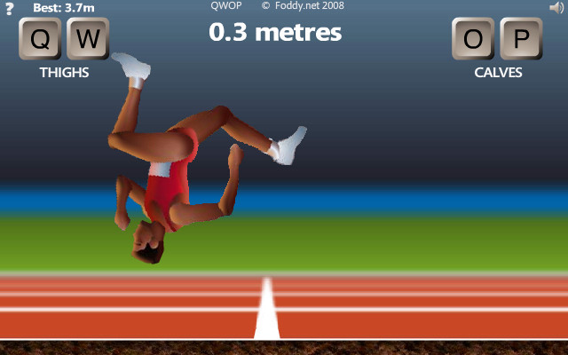
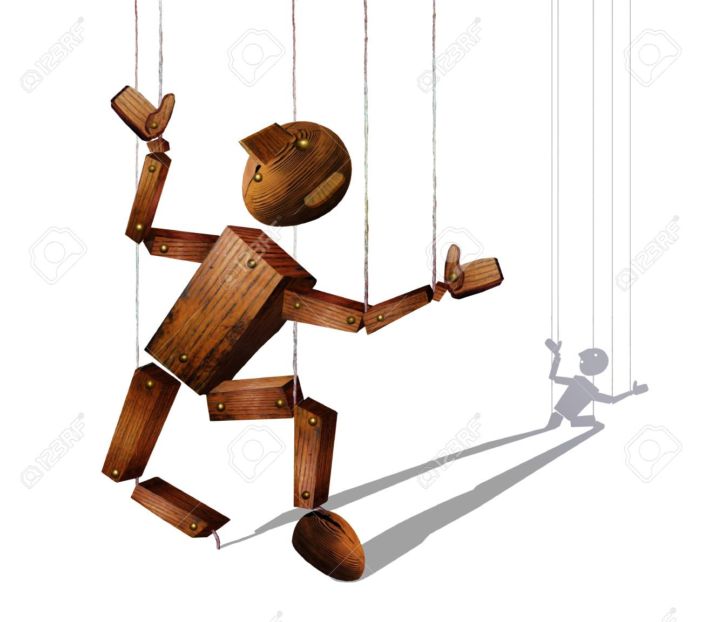

#Process Update no.1

## Super tentative timeline

wk1: Create a prototype model of octopus, connect physical computing data to unity (I've done arduino->unity serial communication before, and am confident in my 3D modeling skills, so I find this to be a good first step!) I'll also be doing some level design sketching, and I want to start off as simple as possible and build more complexity to the level based on do-ability through assessing my progress in these next few weeks. 

wk2: Use flex sensors to test out moving octopus legs (understanding how the incoming data from arduino moves the rigged limbs; using incoming data is good, rigging the limbs is ahhh). Further level design developing as well.

wk3: MAKE OR BREAK WEEK. If I can't get the sensors to work, I will figure out a different way of controlling the octopus whether it's a different method of alternative input or using traditional controllers.

wk4: Prototype of level and playing around with the physics and movement of the octopus with the determined controller. If very successful, I want to play around with other elements of physics like squishiness of the ocotpus and/or water.

wk5: Start to really tweak bugs and gameplay; is the gameplay fun? Is it too easy or too difficult? Add more or less to the level? etc.

wk6: ADD THE jUiCe- music, sound effects, added animation, art, basically all the fun work.

wk7: Finish the game a week early (or at least aim for that so I have an entire extra week when things end up defnitely falling apart).

wk8: Fix everything that definitely fell apart.

## Inspiration

QWOP by Bennett Foddy (gameplay)

I Am Bread and Surgeon Simulator by Bossa Studios (gameplay)

Marionette dolls (alt controller)

Unititled Goose Game by House House (aesthetics and gameplay)

Literally just the toon shading feature in Unity (aesthetics)

## Sketches

# Process Update no. 2

Today, I did some Arduino tests to test bend sensor values being serially sent to unity, and it worked!

